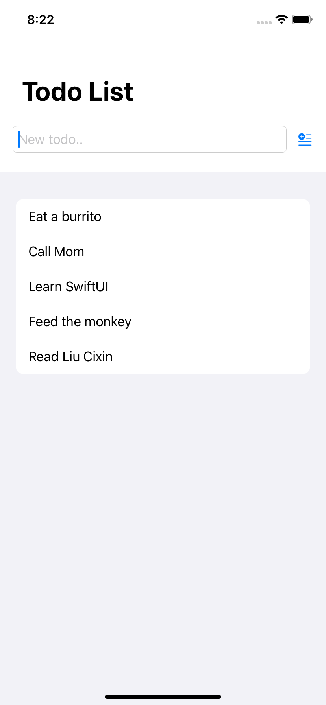

# Todo List

An app to learn how to use Xcode for Swift.

<!-- 

    

 -->

## Features

- setting up a project in Xcode.
- creating a new type to store a todo item in.
- making sure each item can be uniquely identified.
- building a user interface with SwiftUI.
- saving the list of todos.

Based on [Head First Swift](https://www.amazon.com/Head-First-Swift-Anthony-Gray/dp/1491922850) by Jon Manning and Paris Buttfield-Addison (2021).
