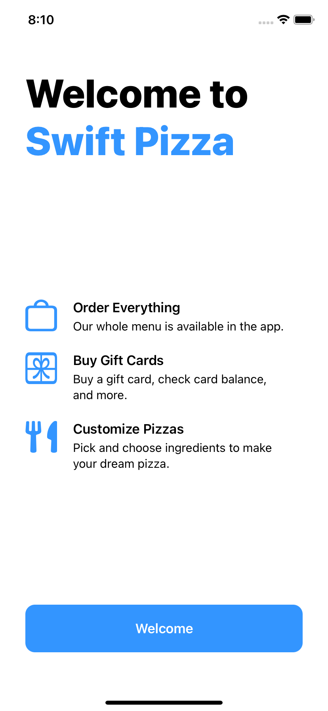

# Swift Pizza

A welcome screen for a pizza app.

    

## Features

- using VStack and HStack.
- styling texts, images and buttons.
- using padding and Spacers.

Based on [Head First Swift](https://www.amazon.com/Head-First-Swift-Anthony-Gray/dp/1491922850) by Jon Manning and Paris Buttfield-Addison (2021).
