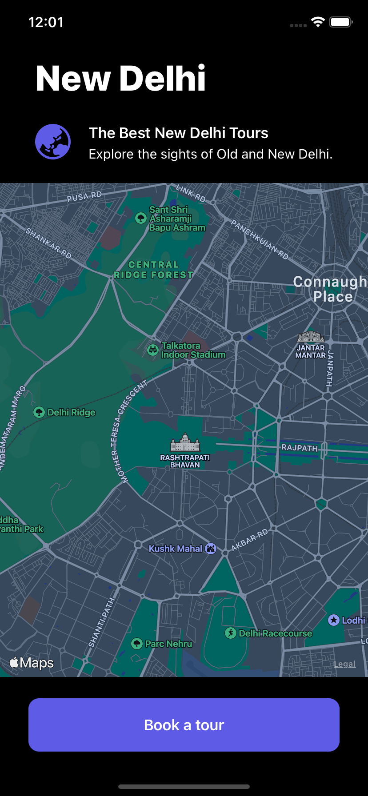

# Dark Map

A map screen to implement dark mode.

    

## Features

- creating a basic UI.
- adding a map with MapKit.
- enabling dark mode in the iOS simulator to preview the result.

Based on [Head First Swift](https://www.amazon.com/Head-First-Swift-Anthony-Gray/dp/1491922850) by Jon Manning and Paris Buttfield-Addison (2021).
