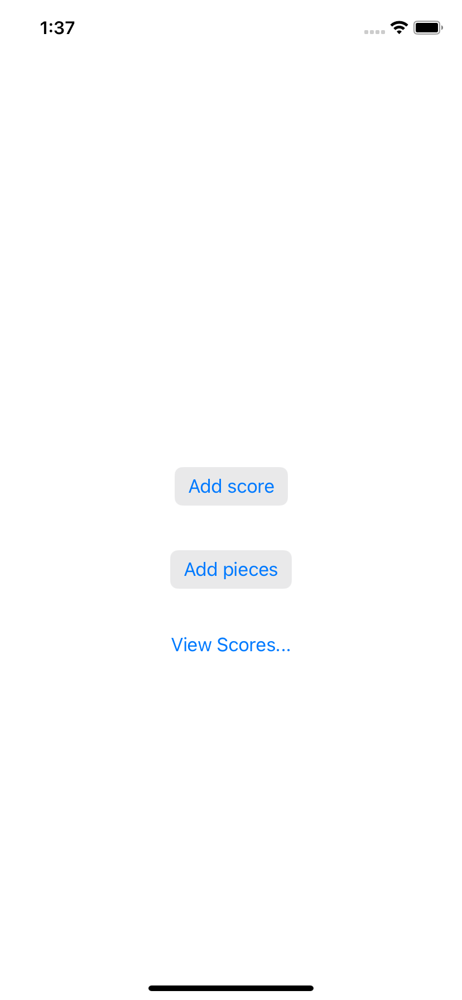

# Score It

A two-view score tracker to learn how to share state.

    

## Features

- implementing a class to store the score and the piece count, conforming to ObservableObject.
- assembling the first view, holding a @StateObject.
- creating a second view, using an @EnvironmentObject.
- navigating between the two views with NavigationView.

Based on [Head First Swift](https://www.amazon.com/Head-First-Swift-Anthony-Gray/dp/1491922850) by Jon Manning and Paris Buttfield-Addison (2021).
