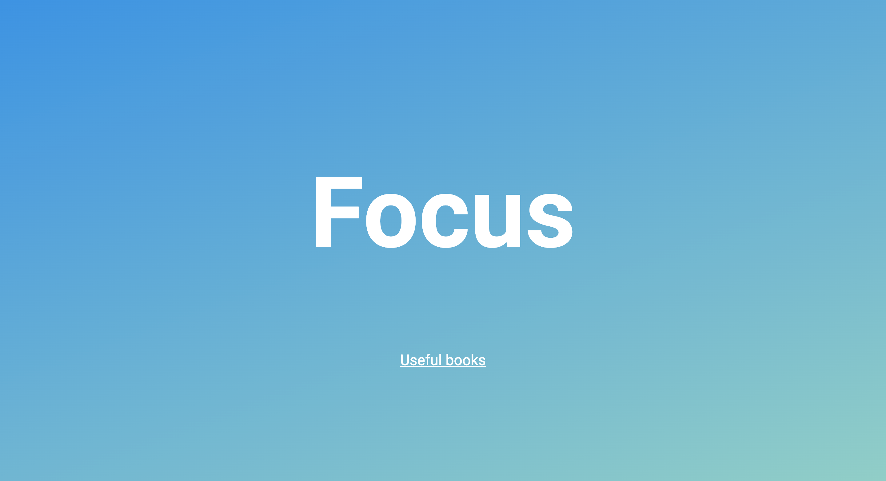

# Focus

A website made with Swift, using Vapor.

<!-- 

    

 -->

## Features

- installing Vapor Toolbox.
- creating a new project, building and running it in Xcode.
- generating new routes.
- handling dynamic parameters.

Based on [Head First Swift](https://www.amazon.com/Head-First-Swift-Anthony-Gray/dp/1491922850) by Jon Manning and Paris Buttfield-Addison (2021).
