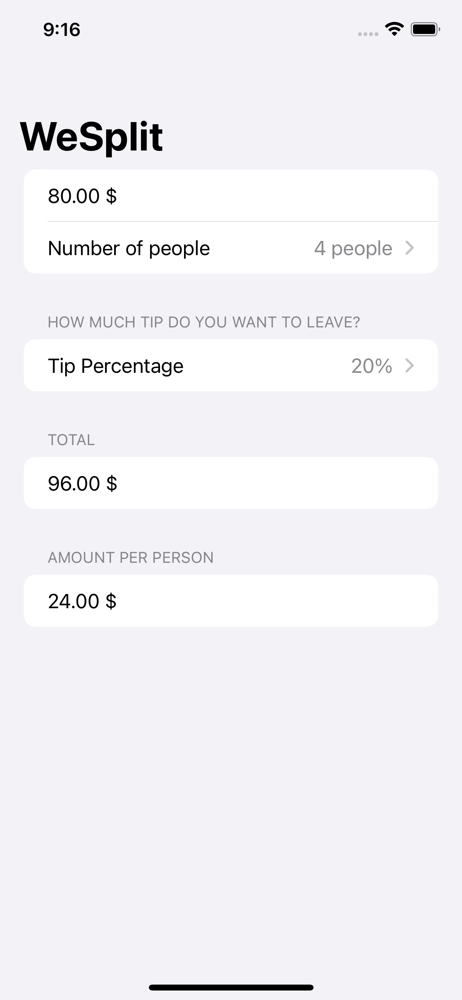

# WeSplit

A check-sharing app.

    

## Features

- creating a form.
- adding a navigation bar.
- modifying program state.
- binding state to user interface controls.
- creating views in a loop.
- reading text from the user with TextField.
- creating pickers in a form.
- adding a segmented control for tip percentages.
- calculating the total per person.
- hiding the keyboard.

Based on [Head First Swift](https://www.amazon.com/Head-First-Swift-Anthony-Gray/dp/1491922850) by Jon Manning and Paris Buttfield-Addison (2021).
