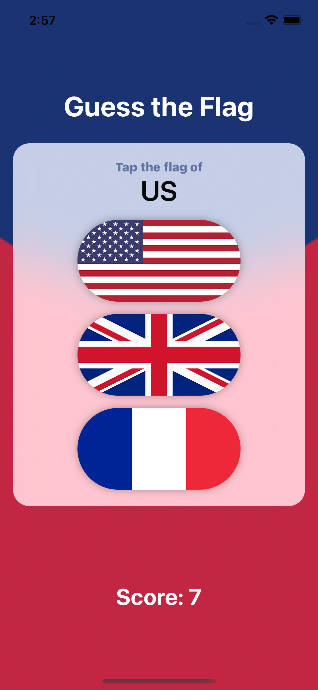

# Guess the Flag

A guessing game on country flags.

    

## Features

- using stacks to arrange views.
- handling colors, frames and gradients.
- displaying buttons and images.
- showing the player's score with an alert.
- stacking up buttons.
- styling and animating the flags.
- adding VoiceOver support.

Based on [100 Days of SwiftUI](https://www.hackingwithswift.com/100/swiftui) by Paul Hudson - Hacking with Swift (2022).
