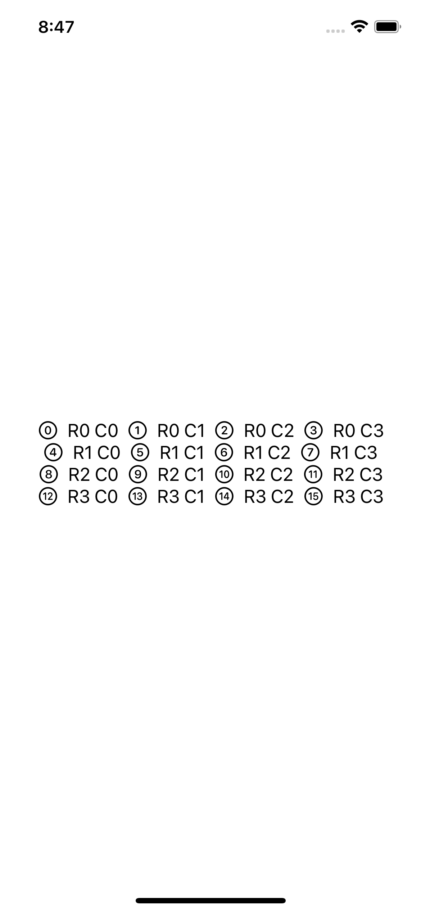

# Views and modifiers

A technique project to learn how to build custom view modifiers and containers.

    

## Features

- using structs for views.
- understanding how to resize the main view in SwiftUI.
- playing with the modifier order.
- using "some View" as a view type.
- using the ternary conditional operator on modifiers.
- applying a modifier to many views at the same time by targetting containers.
- creating views as properties.
- breaking down complex views into smaller views with view composition.
- creating custom modifiers.
- building custom containers.

Based on [100 Days of SwiftUI](https://www.hackingwithswift.com/100/swiftui) by Paul Hudson - Hacking with Swift (2022).
