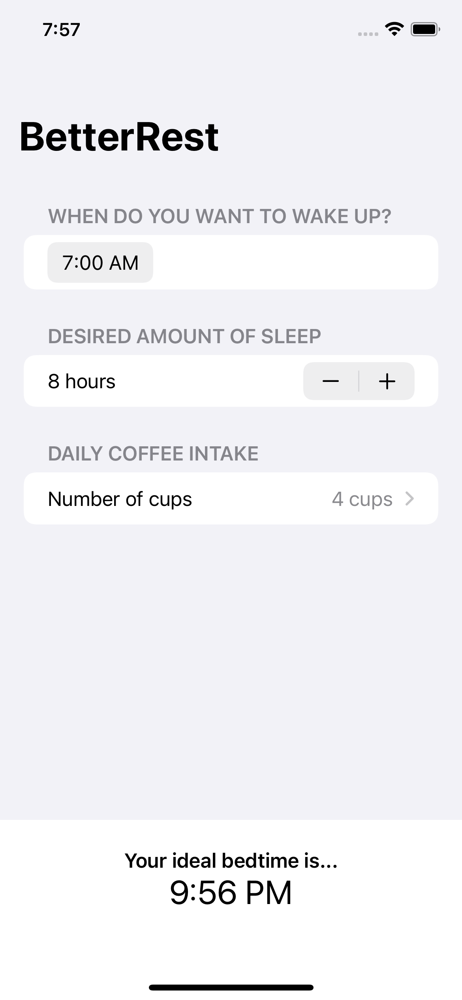

# BetterRest

An app to help coffee drinkers sleep well, using Core ML.

    

## Features

- entering numbers with Stepper.
- selecting dates and times with DatePicker.
- working with dates.
- training a model with Create ML.
- building a basic layout.
- connecting SwiftUI to Core ML.
- cleaning up the user interface.

Based on [100 Days of SwiftUI](https://www.hackingwithswift.com/100/swiftui) by Paul Hudson - Hacking with Swift (2022).
