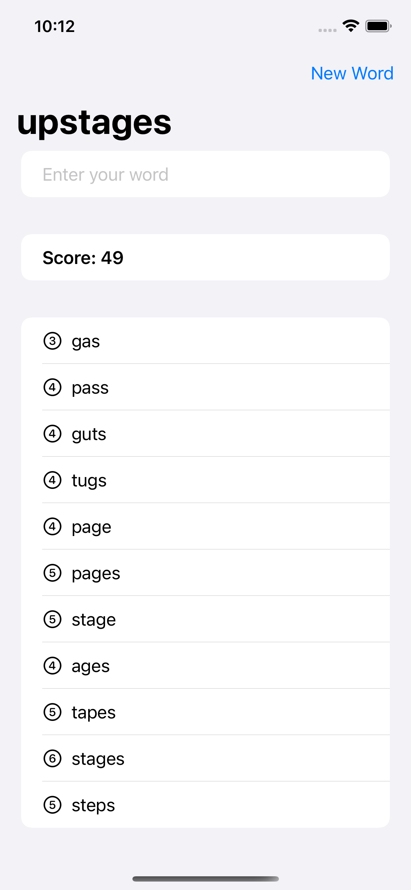

# Word Scramble

A game to generate new words out of a random eight-letter word.

    

## Features

- working with tables of data, using List.
- loading resources from the app bundle.
- working with strings.
- adding to a list of words.
- running code when the app launches.
- validating words with UITextChecker.
- adding VoiceOver support.

Based on [100 Days of SwiftUI](https://www.hackingwithswift.com/100/swiftui) by Paul Hudson - Hacking with Swift (2022).
