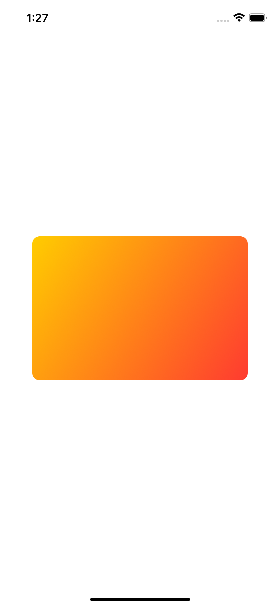

# Animations

A technique project to learn how to use animations.

<!-- 

    

 -->

## Features

- creating implicit animations.
- customizing animations in SwiftUI.
- animating bindings.
- creating explicit animations.
- controlling the animation stack.
- animating gestures.
- showing and hiding views with transitions.
- building custom transitions using ViewModifier.

Based on [100 Days of SwiftUI](https://www.hackingwithswift.com/100/swiftui) by Paul Hudson - Hacking with Swift (2022).
