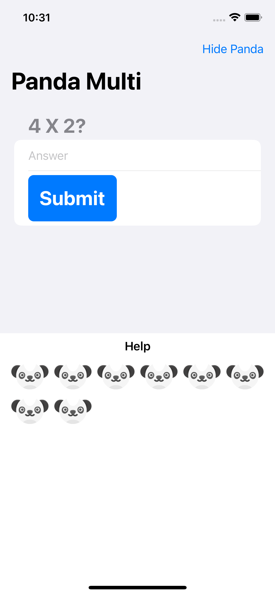

# Panda Multi

An edutainment app to help kids learn multiplication.

<!-- 

    

 -->

## Features

- adding some state to determine if the game is active.
- generating a range of questions based on the user's settings.
- showing the player's score at the end of the game.

Based on [100 Days of SwiftUI](https://www.hackingwithswift.com/100/swiftui) by Paul Hudson - Hacking with Swift (2022).
