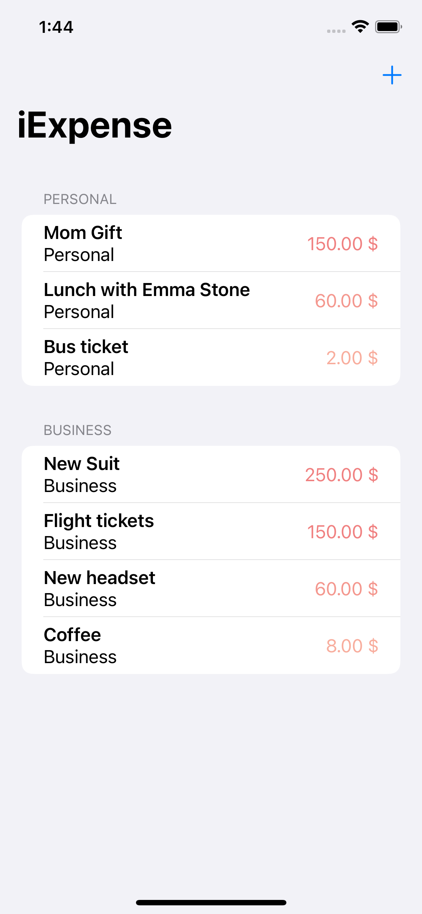

# iExpense

An expense tracker that separates personal costs from business costs.

<!-- 

    

 -->

## Features

- sharing state with @StateObject.
- showing and hiding views.
- deleting items using onDelete().
- storing user settings with UserDefaults.
- archiving Swift objects with Codable.

Based on [100 Days of SwiftUI](https://www.hackingwithswift.com/100/swiftui) by Paul Hudson - Hacking with Swift (2022).
