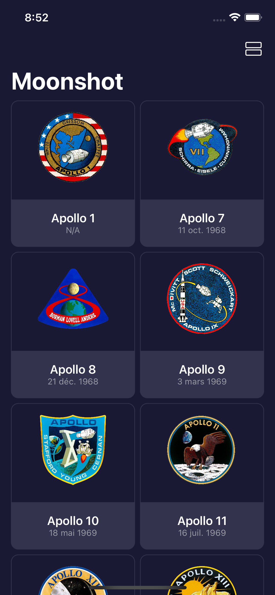

# Moonshot

An app about the missions and astronauts part of Apollo space program.

<!-- 

    

 -->

## Features

- resizing images to fit the screen using GeometryReader.
- scrolling data with ScrollView.
- pushing new views onto the stack with NavigationLink.
- working with hierarchical Codable data.
- using generics to load any kind of Codable data.
- laying out views in a scrolling grid.
- formatting the mission view.
- showing the mission details.

Based on [100 Days of SwiftUI](https://www.hackingwithswift.com/100/swiftui) by Paul Hudson - Hacking with Swift (2022).
