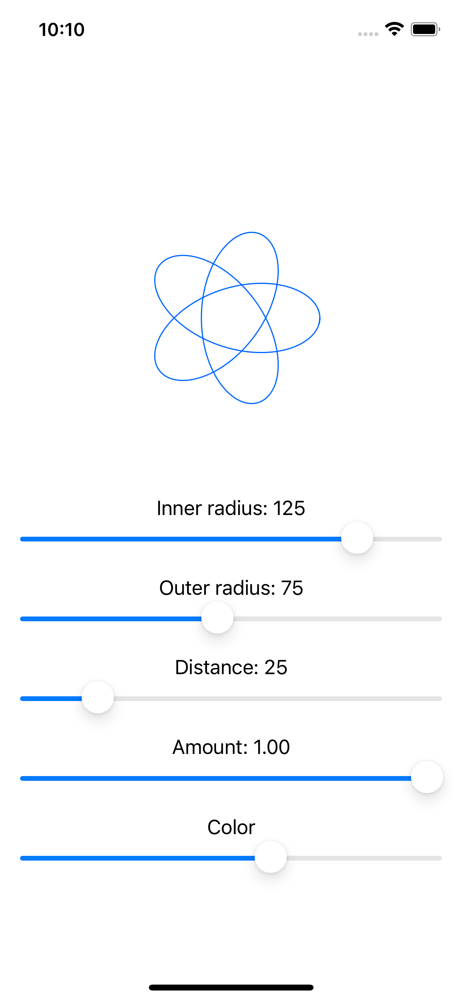

# Drawing

A technique project focusing on drawing.

<!-- 

    

 -->

## Features

- creating custom paths.
- understanding the difference between paths and shapes.
- adding strokeBorder support with InsettableShape.
- transforming shapes using CGAffineTransform and even-odd fills.
- generating creative borders and fills using ImagePaint.
- enabling high-performance Metal rendering with drawingGroup.
- adding special effects with blurs and blending.
- animating simple shapes with animatableData.
- animating complex shapes with AnimatablePair.
- creating a spirograph.

Based on [100 Days of SwiftUI](https://www.hackingwithswift.com/100/swiftui) by Paul Hudson - Hacking with Swift (2022).
