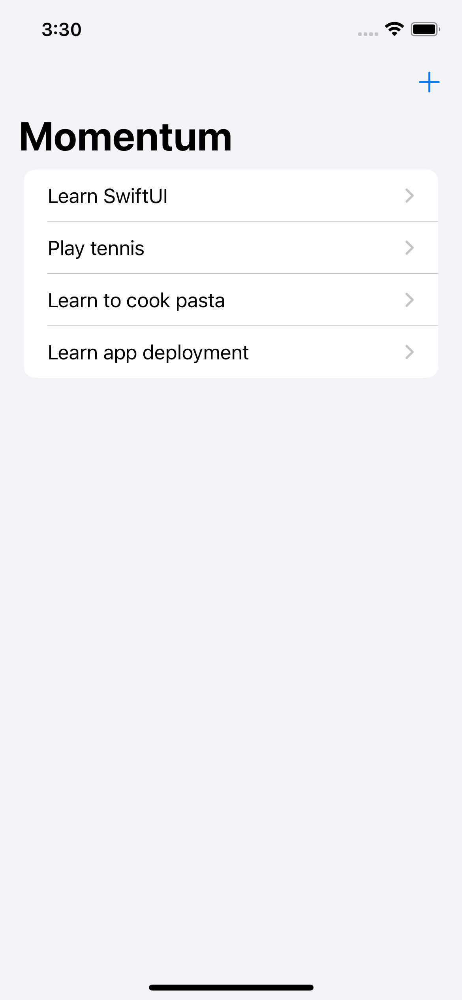

# Momentum

A habit-tracking app.

    

## Features

- defining a struct that holds a single activity.
- creating a class that holds an array of activities.
- using a sheet to present the adding form.
- sharing state between views.
- displaying activity details.
- making a button to increment completion count.

Based on [100 Days of SwiftUI](https://www.hackingwithswift.com/100/swiftui) by Paul Hudson - Hacking with Swift (2022).
