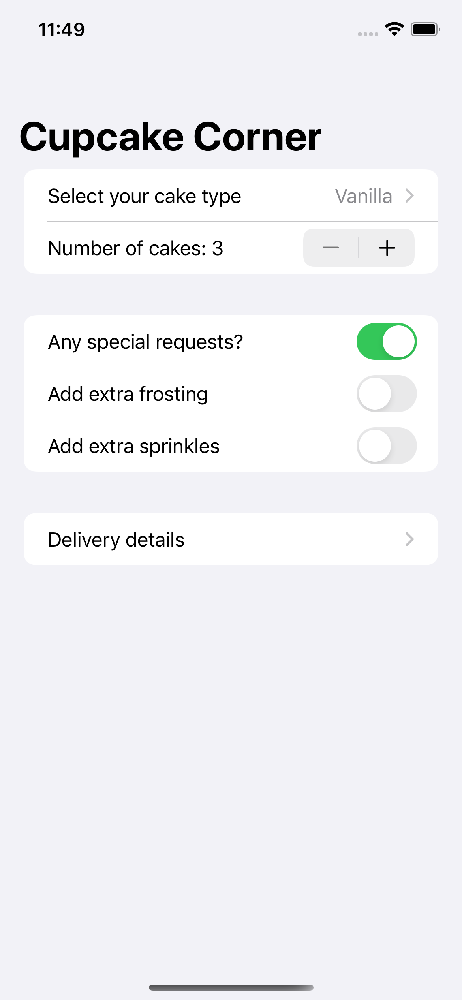

# Cupcake Corner

A multi-screen app for ordering cupcakes.

    

## Features

- adding Codable conformance for @Published properties.
- sending and receiving Codable data with URLSession and SwiftUI.
- loading an image from a remote server.
- validating and disabling forms.
- taking basic order details.
- checking for a valid address.
- preparing for checkout.
- encoding an ObservableObject class.
- sending and receiving orders over the internet.

Based on [100 Days of SwiftUI](https://www.hackingwithswift.com/100/swiftui) by Paul Hudson - Hacking with Swift (2022).
