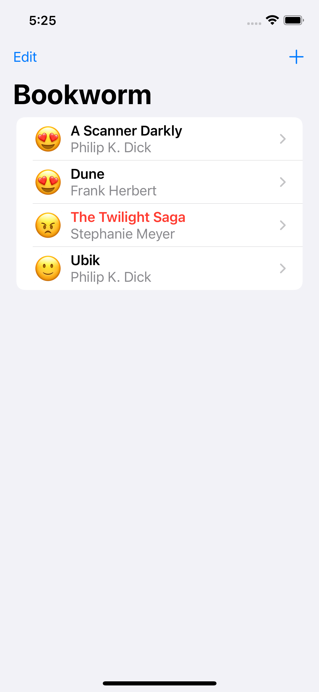

# Bookworm

A reading tracker app, using Core Data.

<!-- 

    

 -->

## Features

- creating a custom component with @Binding.
- accepting multi-line text input with TextEditor.
- combining Core Data with SwiftUI.
- creating books with Core Data.
- adding a custom star rating component.
- building a list with @FetchRequest.
- showing book details.
- sorting fetch requests with SortDescriptor.
- deleting from a Core Data fetch request.
- using an alert to pop a NavigationLink programmatically.

Based on [100 Days of SwiftUI](https://www.hackingwithswift.com/100/swiftui) by Paul Hudson - Hacking with Swift (2022).
