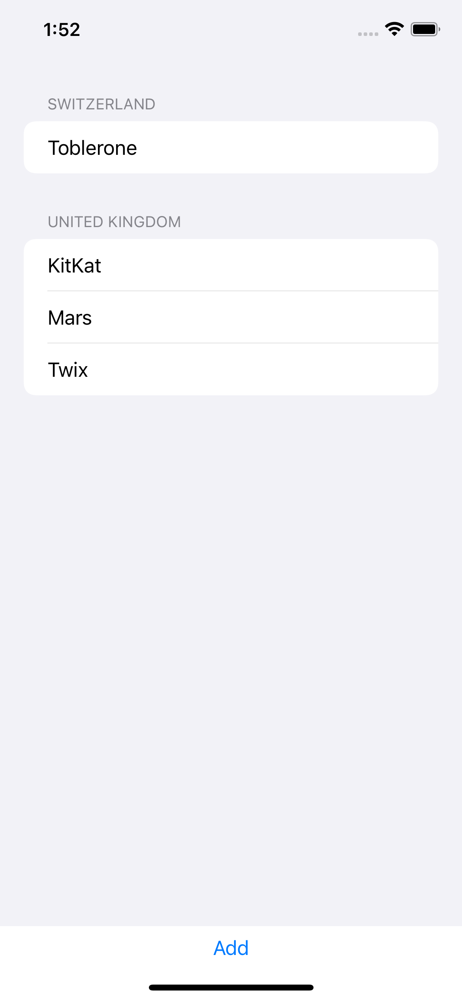

# Core Data

A technique project focusing on Core Data.

    

## Features

- understanding how \\.self works for ForEach.
- creating NSManagedObject subclasses.
- using conditional saving of NSManagedObjectContext.
- ensuring Core Data objects are unique using constraints.
- filtering @FetchRequest using NSPredicate.
- filtering dynamically @FetchRequest with SwiftUI.
- using one-to-many relationships with Core Data, SwiftUI, and @FetchRequest.

Based on [100 Days of SwiftUI](https://www.hackingwithswift.com/100/swiftui) by Paul Hudson - Hacking with Swift (2022).
