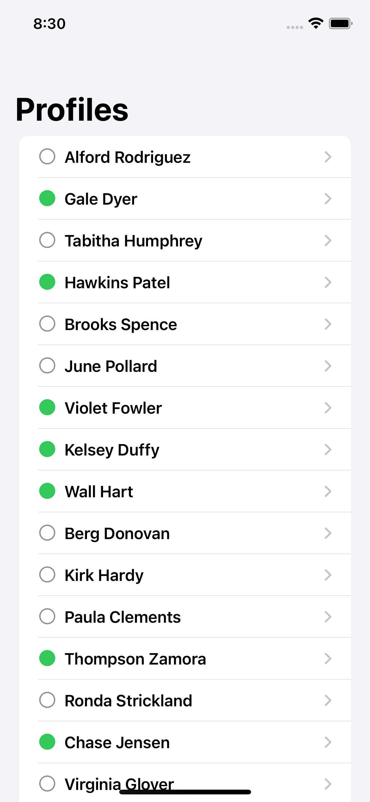

# Profiles

A list of users to download some JSON.

    

## Features

- fetching the data and parsing it.
- displaying a list of users.
- creating a detail view.

Based on [100 Days of SwiftUI](https://www.hackingwithswift.com/100/swiftui) by Paul Hudson - Hacking with Swift (2022).
