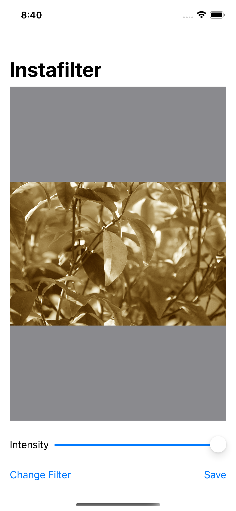

# Instafilter

A photo filter app using Core Image and integrating with UIKit.

    

## Features

- responding to state changes using onChange().
- showing multiple options with confirmationDialog().
- integrating Core Image with SwiftUI.
- wrapping a UIViewController in a SwiftUI view.
- using coordinators to manage SwiftUI view controllers.
- saving images to the user's photo library.
- building a basic UI.
- importing an image into SwiftUI using PHPickerViewController.
- filtering image using Core Image.
- customizing the filter using confirmationDialog().
- saving the filtered image using UIImageWriteToSavedPhotosAlbum().

Based on [100 Days of SwiftUI](https://www.hackingwithswift.com/100/swiftui) by Paul Hudson - Hacking with Swift (2022).
