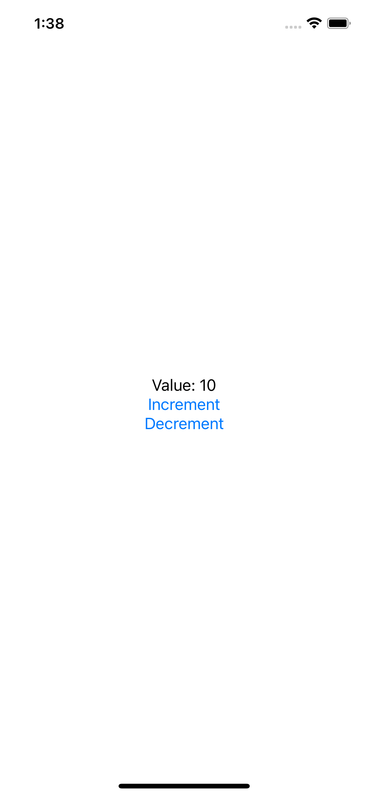

# Accessibility

A technique project to learn accessibility best practices, using VoiceOver.

    

## Features

- identifying views with useful labels.
- hiding and grouping accessibility data.
- reading the value of controls.

Based on [100 Days of SwiftUI](https://www.hackingwithswift.com/100/swiftui) by Paul Hudson - Hacking with Swift (2022).
