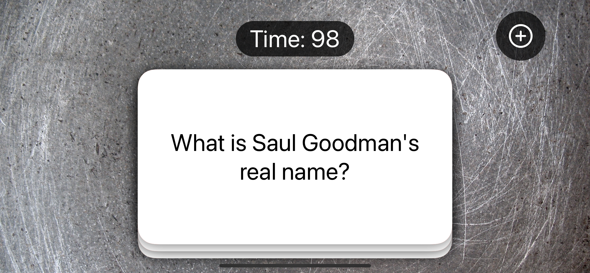

# Flashzilla

A flashcard app, relying on gestures and Core Haptics.

    

## Features

- using gestures in SwiftUI.
- making vibrations with UINotificationFeedbackGenerator and Core Haptics.
- disabling user interactivity with allowsHitTesting().
- triggering events repeatedly using a timer.
- being notified when the app moves to the background.
- supporting specific accessibility needs with SwiftUI.
- designing a single card view.
- building a stack of cards.
- moving views with DragGesture and offset().
- coloring views when the user swipes.
- counting down with a Timer.
- ending the app with allowsHitTesting().
- fixing the bugs.
- adding and deleting cards.

Based on [100 Days of SwiftUI](https://www.hackingwithswift.com/100/swiftui) by Paul Hudson - Hacking with Swift (2022).
