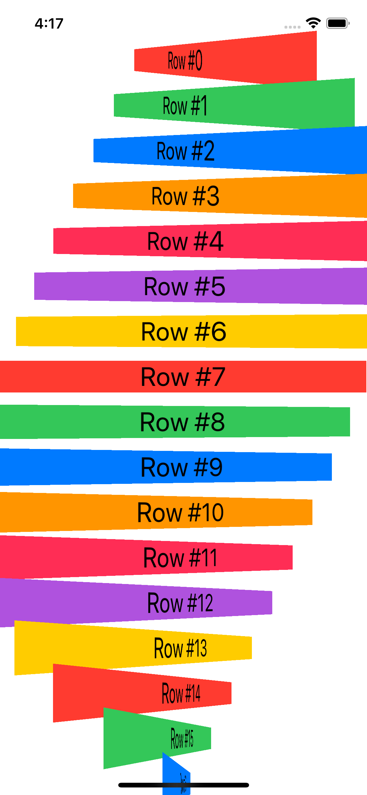

# Layout and Geometry

A technique project to explore how SwiftUI handles layout.

    

## Features

- understanding how layout works in SwiftUI.
- using alignment and alignment guides.
- creating a custom alignment guide.
- enabling absolute positioning for SwiftUI views.
- understanding frames and coordinates inside GeometryReader.
- generating ScrollView effects using GeometryReader.

Based on [100 Days of SwiftUI](https://www.hackingwithswift.com/100/swiftui) by Paul Hudson - Hacking with Swift (2022).
