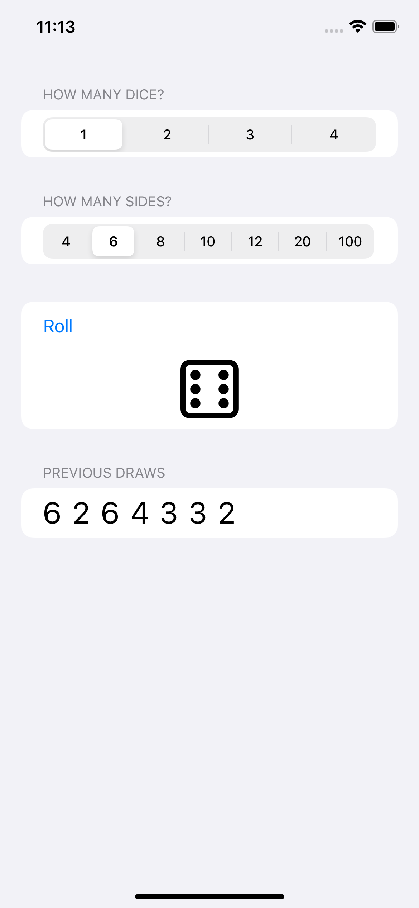

# Dice

A dice app.

    

## Features

- letting the user customizing the dice that are rolled.
- showing the total rolled on the dice.
- storing the results using JSON.
- adding haptic feedback when dice are rolled.
- making the results flick through various values.
- adding support for VoiceOver.

Based on [100 Days of SwiftUI](https://www.hackingwithswift.com/100/swiftui) by Paul Hudson - Hacking with Swift (2022).
