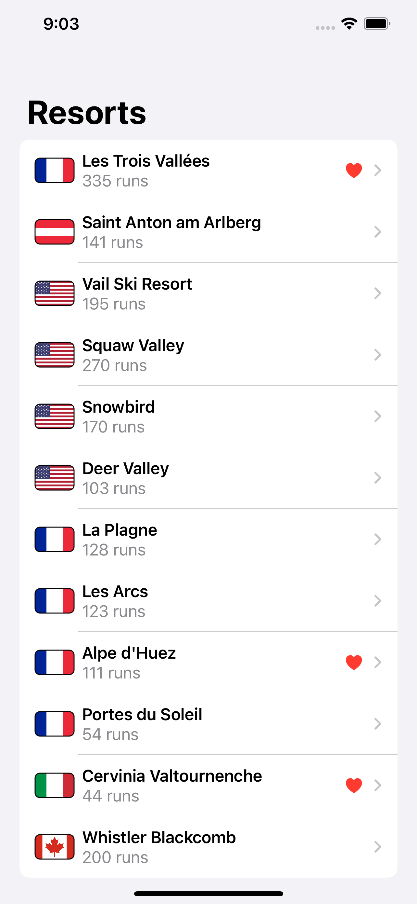

# SnowSeeker

A skier app to browse ski resorts around the world, optimized for iPad.

    

## Features

- working with two side by side views in SwiftUI.
- using alert() and sheet() with optionals.
- using groups as transparent layout containers.
- making a SwiftUI view searchable.
- building a primary list of items.
- making NavigationView work in landscape.
- creating a secondary view for NavigationView.
- searching for data in a List.
- changing a view's layout in response to size classes.
- binding an alert to an optional string.
- letting the user mark favorites.

Based on [100 Days of SwiftUI](https://www.hackingwithswift.com/100/swiftui) by Paul Hudson - Hacking with Swift (2022).
