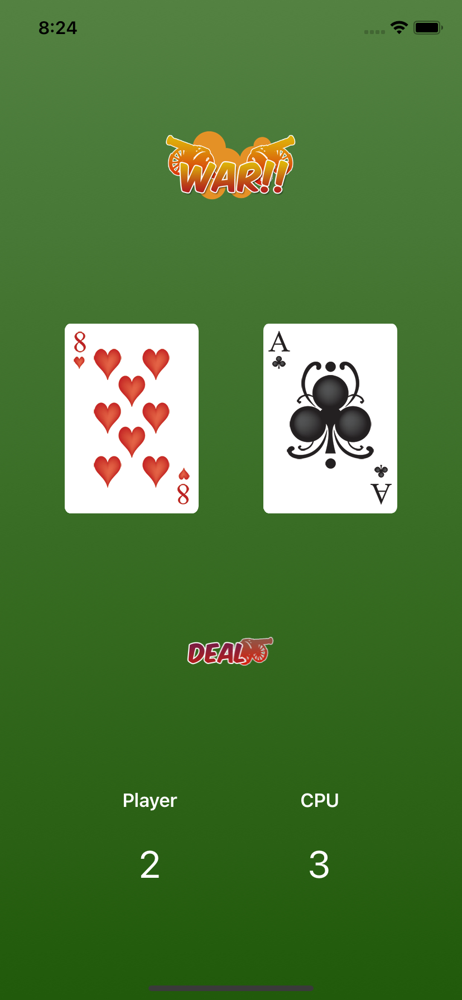
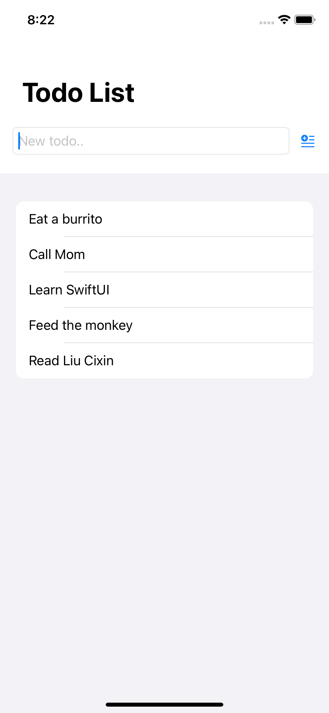
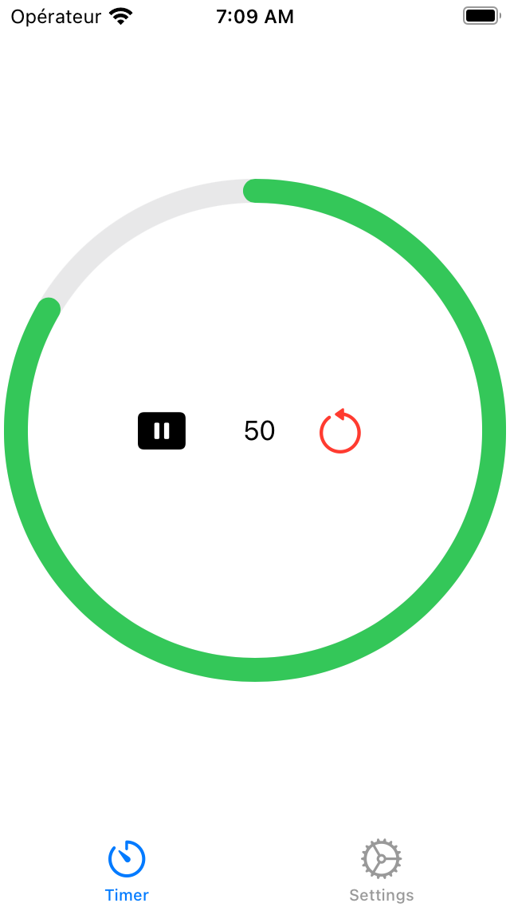
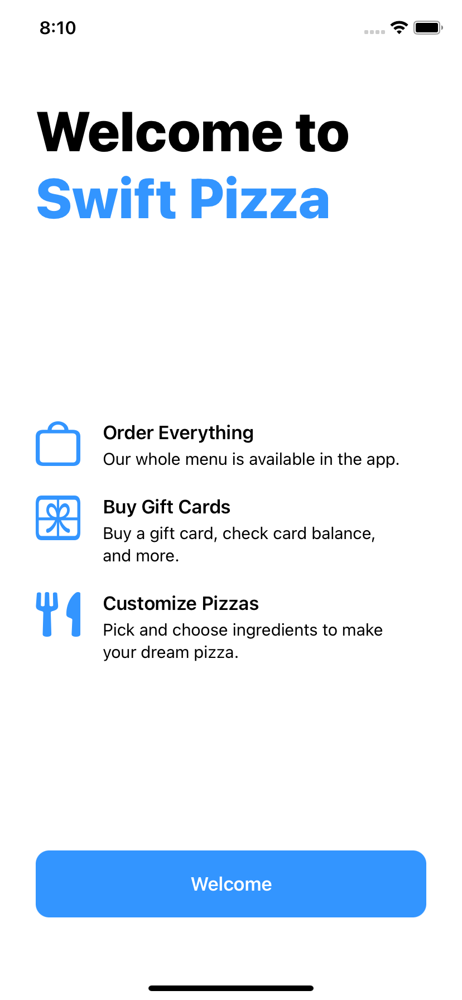
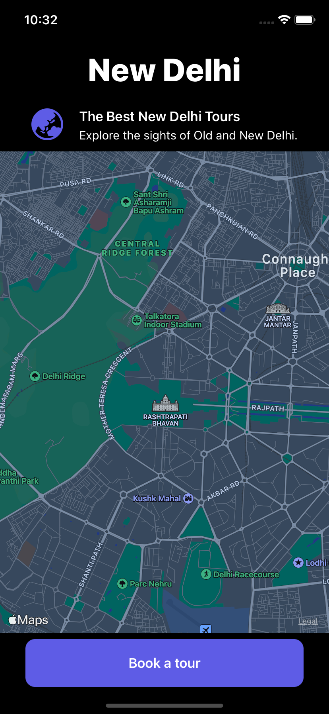
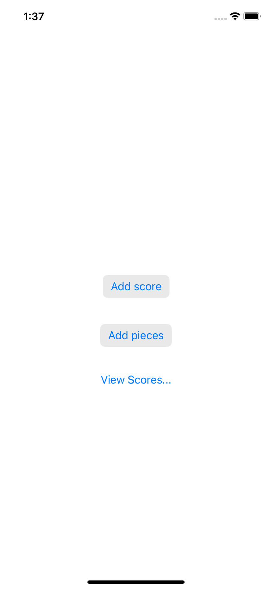

# Swift Projects

6 projects to understand Swift core concepts.

| #   | Project                           | Description                                           |
| --- | --------------------------------- | ----------------------------------------------------- |
| 01  | [**War Card Game**](#warcardgame) | A card game to learn Swift and SwiftUI.               |
| 02  | [**Todo List**](#todolist)        | An app to learn how to use Xcode for Swift.           |
| 03  | [**Executive Timer**](#timer)     | A timer for meetings.                                 |
| 04  | [**Swift Pizza**](#swiftpizza)    | A welcome screen for a pizza app.                     |
| 05  | [**Dark Map**](#darkmap)          | A map screen to implement dark mode.                  |
| 06  | [**Score It**](#scoreit)          | A two-view score tracker to learn how to share state. |

Check the [playground](https://github.com/solygambas/swift-projects/tree/main/playground) if you want to learn Swift syntax first.

##  1) War Card Game

A card game to learn Swift and SwiftUI.

[See 01-war-card-game folder](https://github.com/solygambas/swift-projects/tree/main/01-war-card-game)

    

## Features

- building the layout with SwiftUI.
- using properties in view code.
- understanding the state property wrapper, dynamic and immutable values.
- handling user actions.
- comparing values using if statements.

Based on [SwiftUI Tutorial for Beginners](https://www.youtube.com/watch?v=F2ojC6TNwws) by Chris Ching - CodeWithChris (2021).

##  2) Todo List

An app to learn how to use Xcode for Swift.

[See 02-todo-list folder](https://github.com/solygambas/swift-projects/tree/main/02-todo-list)

    

## Features

- setting up a project in Xcode.
- creating a new type to store a todo item in.
- making sure each item can be uniquely identified.
- building a user interface with SwiftUI.
- saving the list of todos.

Based on [Head First Swift](https://www.amazon.com/Head-First-Swift-Anthony-Gray/dp/1491922850) by Jon Manning and Paris Buttfield-Addison (2021).

##  3) Timer

A timer for meetings.

[See 03-executive-timer folder](https://github.com/solygambas/swift-projects/tree/main/03-executive-timer)

    

## Features

- creating a SwiftUI Xcode project for iOS.
- creating the basic elements of the UI.
- making the timer update the UI.
- using SF Symbols.
- displaying two tabs with a TabView.

Based on [Head First Swift](https://www.amazon.com/Head-First-Swift-Anthony-Gray/dp/1491922850) by Jon Manning and Paris Buttfield-Addison (2021).

##  4) Swift Pizza

A welcome screen for a pizza app.

[See 04-swift-pizza folder](https://github.com/solygambas/swift-projects/tree/main/04-swift-pizza)

    

## Features

- using VStack and HStack.
- styling texts, images and buttons.
- using padding and Spacers.

Based on [Head First Swift](https://www.amazon.com/Head-First-Swift-Anthony-Gray/dp/1491922850) by Jon Manning and Paris Buttfield-Addison (2021).

##  5) Dark Map

A map screen to implement dark mode.

[See 05-dark-map folder](https://github.com/solygambas/swift-projects/tree/main/05-dark-map)

    

## Features

- creating a basic UI.
- adding a map with MapKit.
- enabling dark mode in the iOS simulator to preview the result.
- adding local images.
- loading an image from the web with AsyncImage.

Based on [Head First Swift](https://www.amazon.com/Head-First-Swift-Anthony-Gray/dp/1491922850) by Jon Manning and Paris Buttfield-Addison (2021).

##  6) Score It

A two-view score tracker to learn how to share state.

[See 06-score-it folder](https://github.com/solygambas/swift-projects/tree/main/06-score-it)

    

## Features

- implementing a class to store the score and the piece count, conforming to ObservableObject.
- assembling the first view, holding a @StateObject.
- creating a second view, using an @EnvironmentObject.
- navigating between the two views with NavigationView.

Based on [Head First Swift](https://www.amazon.com/Head-First-Swift-Anthony-Gray/dp/1491922850) by Jon Manning and Paris Buttfield-Addison (2021).
