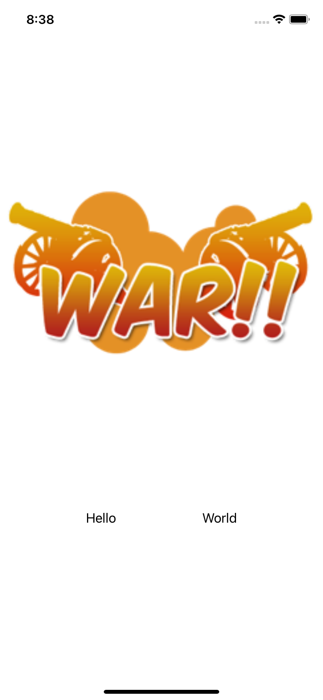

# UI Test

A quick intro to Xcode, Swift and SwiftUI.

    

## Features

- setting up a Swift Project in Xcode.
- previewing the UI with Xcode.
- building the UI with SwiftUI.
- playing with basic UI views and containers.
- instantiating buttons, using closures and trailing closures.

Based on [SwiftUI Tutorial for Beginners](https://www.youtube.com/watch?v=F2ojC6TNwws) by Chris Ching - CodeWithChris (2021).
