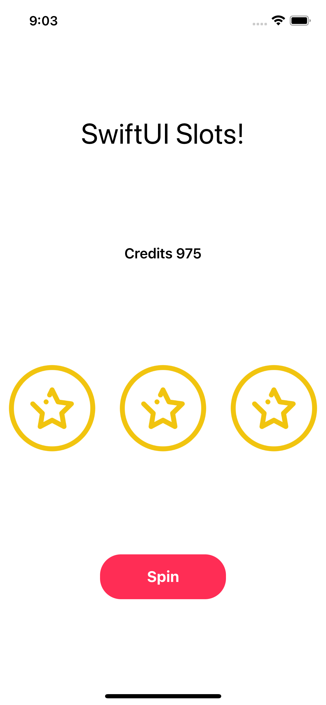

# SwiftUI Slots

A simple slot machine game.

    

## Features

- handling the state.
- customizing the button.
- resizing the images to fit the screen.
- updating the player credit based on the result.

Based on [SwiftUI Tutorial for Beginners](https://www.youtube.com/watch?v=F2ojC6TNwws) by Chris Ching - CodeWithChris (2021).
